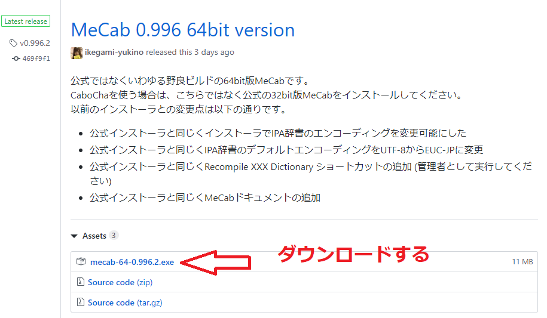
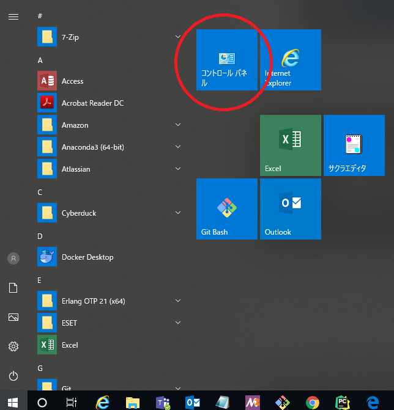
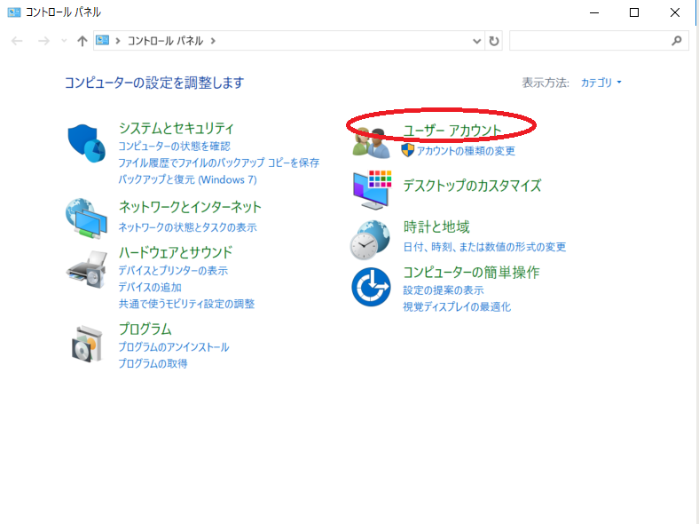
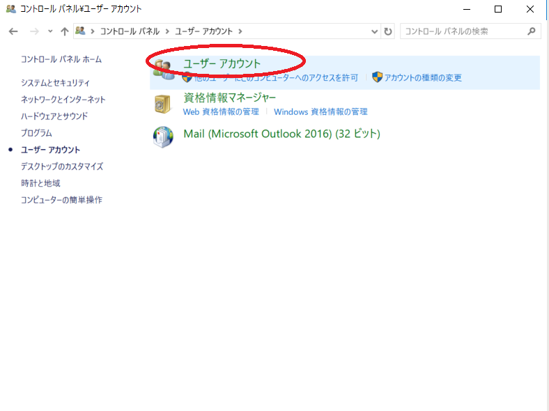
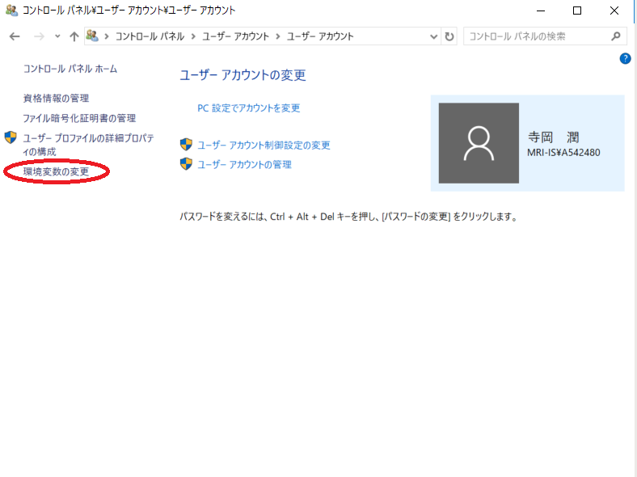
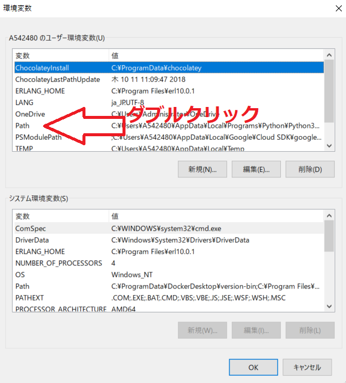
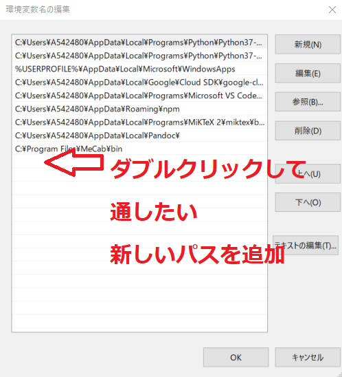
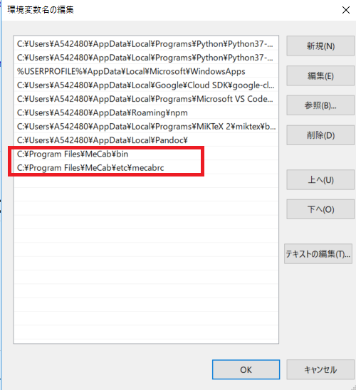

# テキストの類似度を評価

```
$ git clone https://github.com/hiroshi-teraoka/Text_similarity_evaluation.git
$ cd Text_similarity_evaluation
$ virtualenv venv

例）以下の様に、input用エクセルファイル（記載方法は中身参照）とoutput用パスを引数にして実行すると評価値をエクセルファイルで出力します
$ python text_evaluation.py input_excel/input_指向性.xlsx output_excel/output_指向性.xlsx
```


# Mecabをインストール

MecabをWindows10へインストールする手順  
参考サイト：https://qiita.com/yuki12/items/9723f60907508b11504b  
尚、Anacondaではなくvirtualenvを使い環境を作ります。
```
$ virtualenv.exe venv
$ source venv/Scripts/activate
(venv)
$ pip install ipykernel
(venv)
$ pip install mecab-python-windows
```

  

  

  

  

  

  

  

**以下のパスに今回インストールされていたので環境パス指定しています（ここは人によって変わる可能性もある）**
  


これで、後は試しに以下のソースコードを実行してみて
エラーがでず結果表示されると成功。

(test.py)
```
import MeCab
mecab = MeCab.Tagger ("-Ochasen")
print(mecab.parse("すもももももももものうち"))
```
(venv)  
$ python test.py

-------------------------------------

# SumEvalというPythonのテキスト評価用のライブラリ

```
$ pip install spacy
$ python -m spacy download en
$ pip install janome
$ pip install git+https://github.com/tagucci/pythonrouge.git
$ pip install git+git://github.com/bdusell/rougescore.git
$ pip install sumeval
```

Cabochaを使えるようにする  
https://qiita.com/osyou-create/items/4e2f686d82bf9e1166e8  

